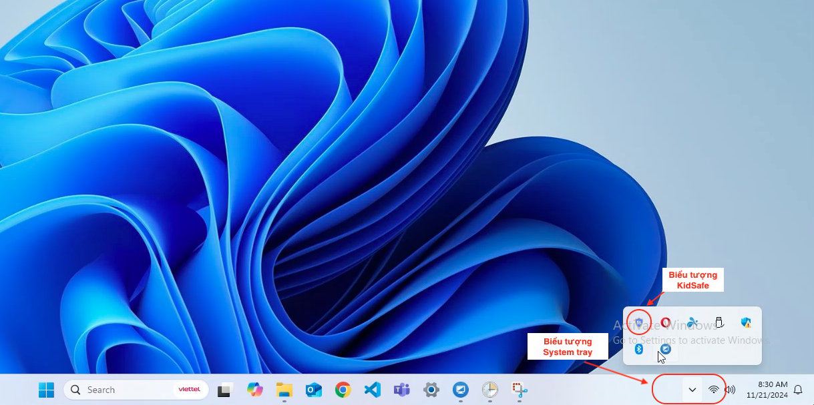
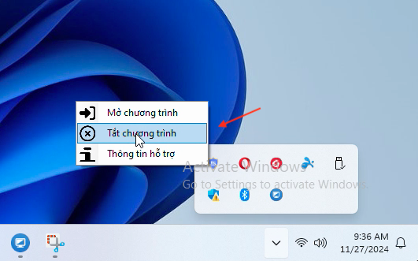
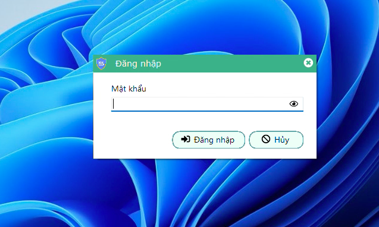
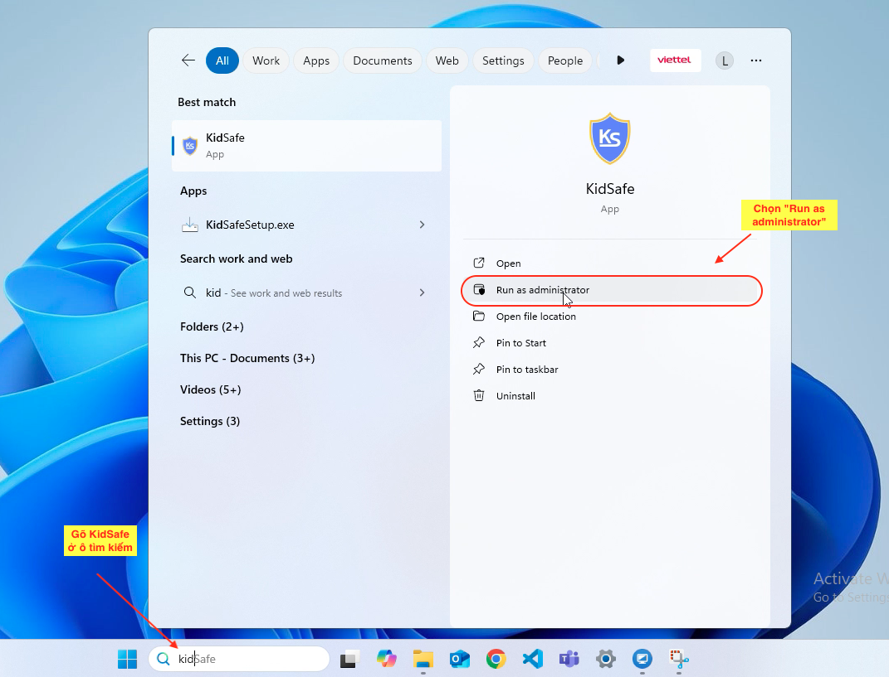
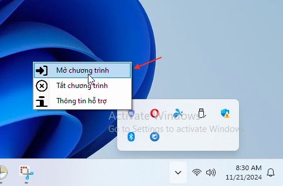
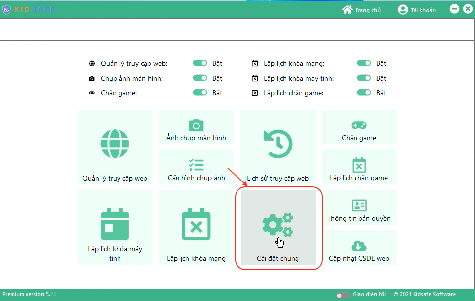
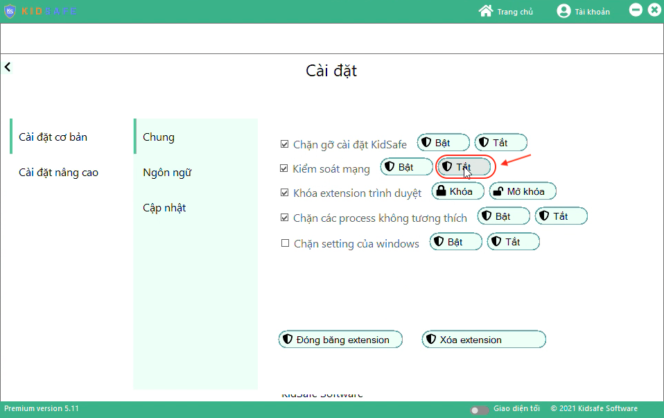
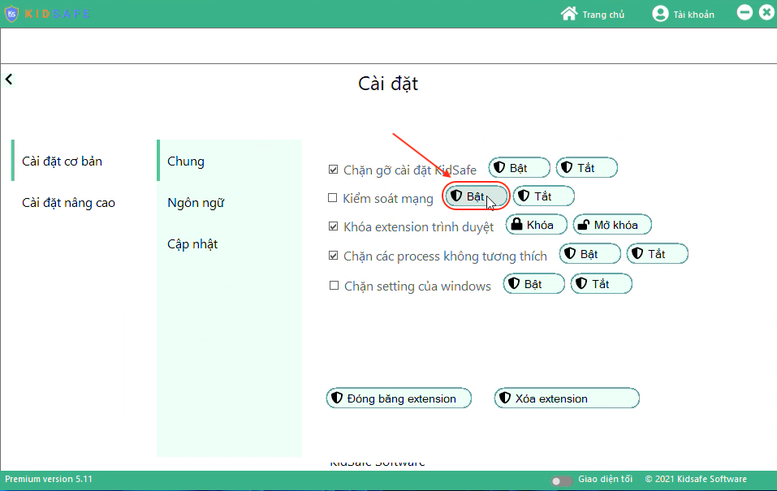

# Hướng dẫn bật/tắt kiểm soát mạng bằng quyền admin

Trong một số trường hợp bị lỗi không đăng nhập được OneDrive hoặc Microsoft Teams của Microsoft, hãy thực hiện theo các bước dưới đây:

---

## Bước 1: Tắt KidSafe

1. **Mở System Tray ở góc dưới cùng bên phải màn hình**:  
   

2. **Nhấp chuột phải vào biểu tượng KidSafe và chọn "Tắt chương trình"**:  
   

3. **Nhập mật khẩu quản trị của KidSafe để xác nhận**:  
   

---

## Bước 2: Mở lại KidSafe bằng quyền admin

1. **Tìm KidSafe trong thanh tìm kiếm và chọn "Run as administrator"**:  
   

2. **Mở lại System Tray ở góc dưới cùng bên phải màn hình**:  
   

3. **Nhấp chuột phải vào biểu tượng KidSafe và chọn "Mở chương trình"**:  
   

4. **Nhập lại mật khẩu quản trị của KidSafe để xác nhận**:  
   

---

## Bước 3: Tắt kiểm soát mạng ở mục Cài đặt chung

1. **Truy cập mục "Cài đặt chung"**:  
   

2. **Tại dòng "Kiểm soát mạng", nhấn "Tắt"**:  
   

    **_Lưu ý:_** Hành động chỉ thành công khi checkbox ở mục này được bỏ tích.  
     

---

## Bước 4: Đăng nhập vào Microsoft Teams và OneDrive

-   Đăng nhập vào các phần mềm Microsoft Teams, Microsoft OneDrive, v.v.  
    **_Lưu ý:_** Tích chọn "Giữ tôi luôn đăng nhập" hoặc "Không hỏi lại" ở màn hình đăng nhập của các phần mềm này.

---

## Bước 5: Bật lại kiểm soát mạng ở mục Cài đặt chung

-   Quay lại màn hình "Cài đặt" ở bước 3.

-   Tại dòng "Kiểm soát mạng", nhấn "Bật":  
    

    **_Lưu ý:_** Hành động chỉ thành công khi checkbox được tích.  
    

---

## Kết luận

Thực hiện đầy đủ các bước trên để khắc phục lỗi và đảm bảo các ứng dụng Microsoft hoạt động bình thường.
