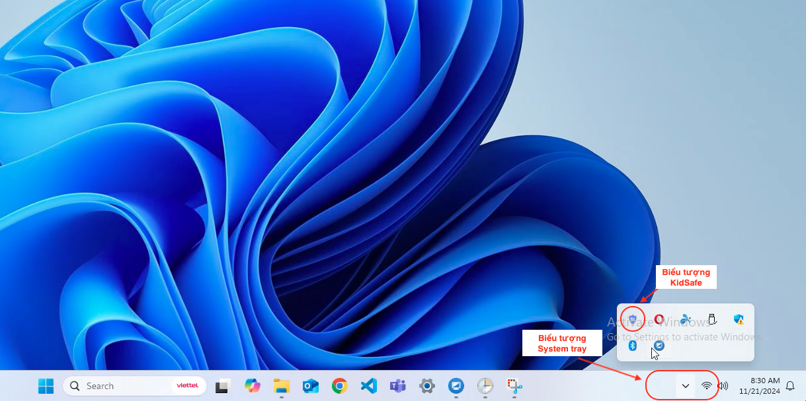
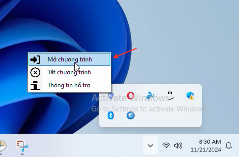

# Mở KidSafe trên máy tính

## Bước 1: Click vào góc dưới cùng bên phải để mở System Tray

## Bước 2: Nhấp chuột phải vào biểu tượng KidSafe và chọn Mở.

## Bước 3: Nhập mật khẩu quản trị của KidSafe để đăng nhập

Đây là mật khẩu bạn nhập lúc cài đặt KidSafe

