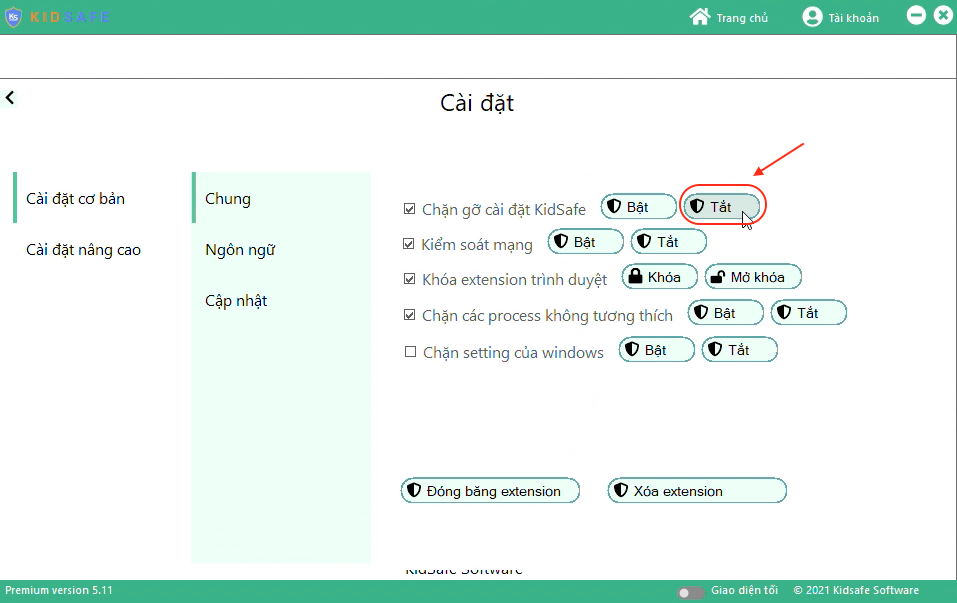
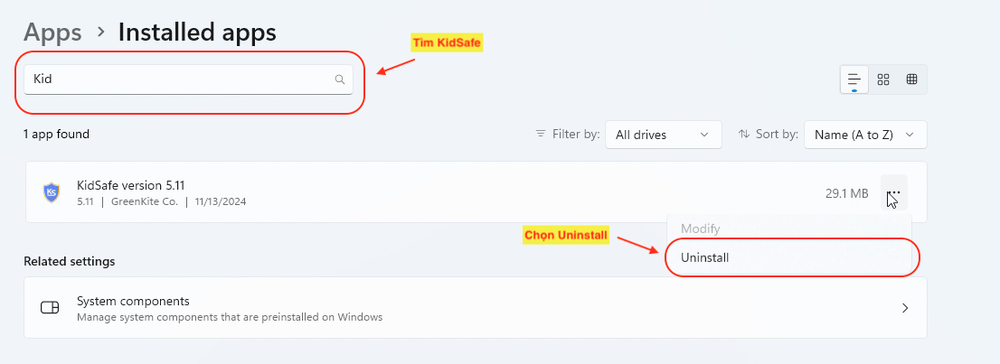

# Gỡ cài đặt KidSafe trên máy tính

Làm theo các bước dưới đây để gỡ cài đặt KidSafe trên máy tính một cách dễ dàng.

---

## Bước 1: Mở KidSafe trên máy tính

-   Xem hướng dẫn chi tiết tại đây: [Hướng dẫn mở KidSafe](../open-pc)

---

## Bước 2: Vào mục Cài đặt chung

-   Truy cập vào **Cài đặt chung** trong giao diện của KidSafe.  
    

---

## Bước 3: Tắt "Chặn gỡ cài đặt KidSafe"

-   Tại dòng **"Chặn gỡ cài đặt KidSafe"**, nhấn **"Tắt"** để cho phép gỡ cài đặt.  
    

---

## Bước 4: Gỡ cài đặt từ Control Panel

1. Nhấn tổ hợp phím **Windows + R**, nhập `control` và nhấn Enter để mở **Control Panel**.
2. Chọn **"Programs" (Chương trình)** > **"Programs and Features" (Chương trình và Tính năng)**.
3. Tìm kiếm **"KidSafe"** trong danh sách các chương trình đã cài đặt.
4. Nhấp chuột phải vào **"KidSafe"** và chọn **"Uninstall" (Gỡ cài đặt)**.
5. Làm theo hướng dẫn trên màn hình để hoàn tất quá trình gỡ cài đặt.

    Hình minh họa:  
    

---

## Video hướng dẫn

Xem thêm video hướng dẫn chi tiết quá trình gỡ KidSafe:

<iframe 
    width="560" 
    height="315" 
    src="https://www.youtube.com/embed/0dU5XkMC5bI?si=H5iuVMU2Zxy_Wfws" 
    title="YouTube video player" 
    frameborder="0" 
    allow="accelerometer; autoplay; clipboard-write; encrypted-media; gyroscope; picture-in-picture; web-share" 
    referrerpolicy="strict-origin-when-cross-origin" 
    allowfullscreen>
</iframe>
