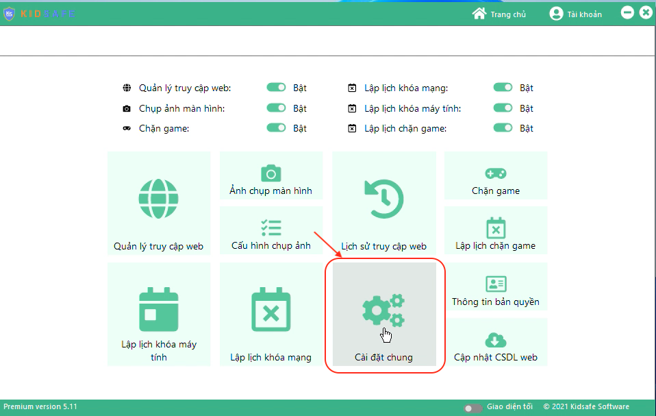

# Gỡi cài đặt KidSafe trên máy tính

## Bước 1: Mở KidSafe trên máy tính

-   Xem hướng dẫn ở đây [Hướng dẫn mở KidSafe](../open-pc)

## Bước 2: Vào mục Cài đặt chung

## Bước 3: Ở dòng "Chặn gỡ cài đặt KidSafe", nhấn "Tắt"

## Bước 4: Mở Control Panel, thực hiện các thao tác

-   Nhấn tổ hợp phím Windows + R, nhập control và nhấn Enter để mở Control Panel.
-   Chọn "Programs" (Chương trình) > "Programs and Features" (Chương trình và Tính năng).
-   Tìm kiếm "KidSafe" trong danh sách các chương trình đã cài đặt.
-   Nhấp chuột phải vào "KidSafe" và chọn "Uninstall" (Gỡ cài đặt).
-   Làm theo hướng dẫn trên màn hình để hoàn tất quá trình gỡ cài đặt.

---

Xem thêm video hướng dẫn gỡ KidSafe:

<iframe width="560" height="315" src="https://www.youtube.com/embed/0dU5XkMC5bI?si=H5iuVMU2Zxy_Wfws" title="YouTube video player" frameborder="0" allow="accelerometer; autoplay; clipboard-write; encrypted-media; gyroscope; picture-in-picture; web-share" referrerpolicy="strict-origin-when-cross-origin" allowfullscreen></iframe>
