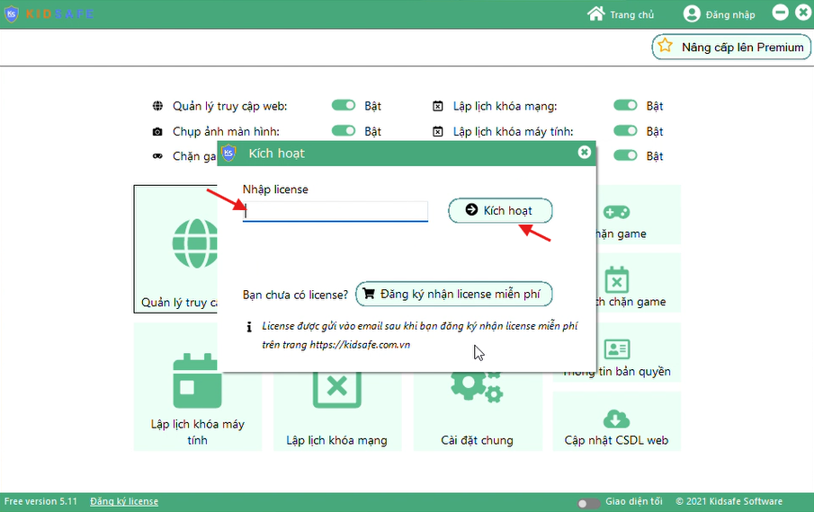
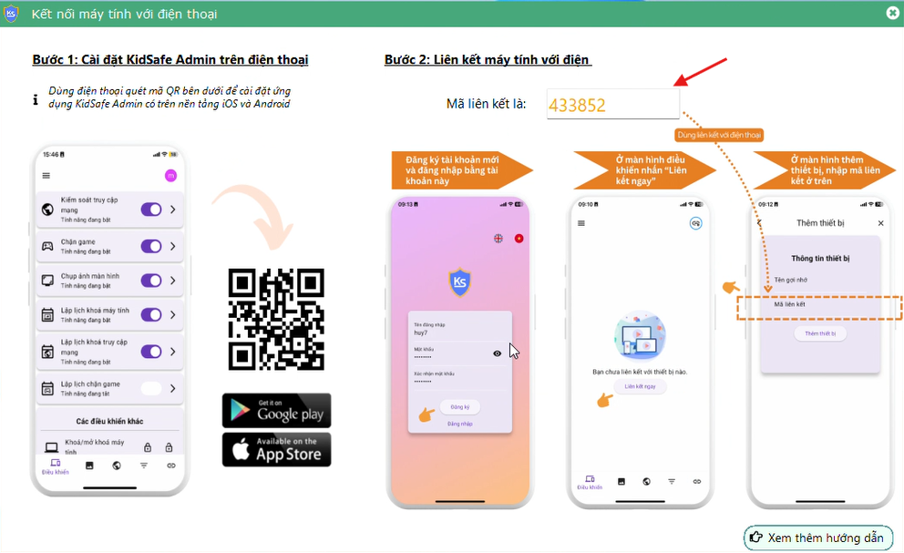

# Kích hoạt license & lấy mã kích hoạt

## Bước 1: Kích hoạt license trên KidSafe

1. Sau khi thiết lập mật khẩu quản trị, KidSafe sẽ hiển thị màn hình **“Kích hoạt”**.
2. Nhập mã **license** đã mua vào ô tương ứng.
3. Nhấn **“Kích hoạt”** để tiếp tục.
4. Nếu license hợp lệ, hệ thống sẽ thông báo: **“Đăng ký license thành công”**.
5. Trong trường hợp bạn muốn đăng ký lại license cho máy khác:
    - Tích chọn **“Đăng ký lại cho máy khác”**.
    - Nhập thêm mã kích hoạt vào ô **“Mã kích hoạt”**.

## Bước 2: Lấy mã liên kết để kết nối với điện thoại

1. Sau khi kích hoạt license thành công trên máy tính, hệ thống sẽ tự động sinh ra một **mã liên kết** để kết nối với ứng dụng KidSafe Admin trên điện thoại.
2. Ví dụ: Mã liên kết được sinh ra là **433852** (hiển thị bên dưới giao diện kích hoạt).

## Lưu ý

-   Đảm bảo nhập chính xác mã license và mã kích hoạt để tránh lỗi khi kích hoạt.
