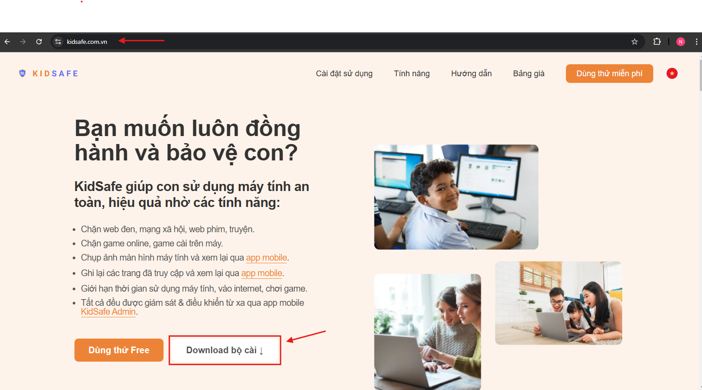
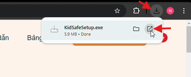
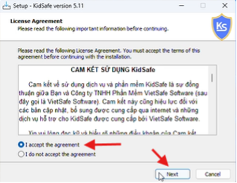
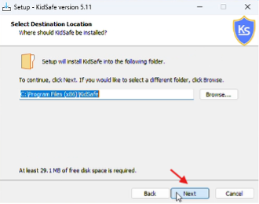
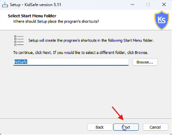
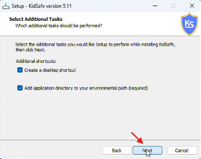
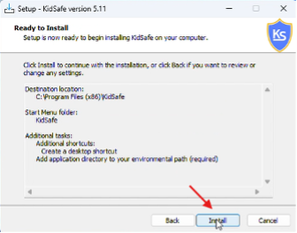
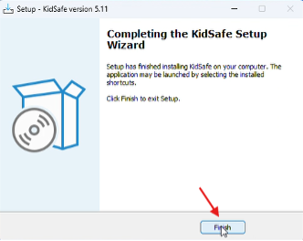
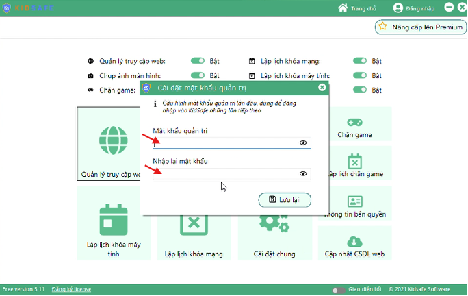

# Tải ứng dụng và cài đặt trên máy tính

## Bước 1: Tải bộ cài từ trang web chính thức

1. Truy cập trang web [https://kidsafe.com.vn](https://kidsafe.com.vn).
2. Nhấn nút **“Download bộ cài”** để tải ứng dụng KidSafe.

## Bước 2: Mở file cài đặt

1. Chờ file **KidSafeSetup.exe** được tải về máy tính.
2. Nhấp đôi vào file **KidSafeSetup.exe** để bắt đầu cài đặt.

## Bước 3: Thực hiện cài đặt

1. Chọn **"I accept the agreement"** và nhấn **"Next"**.

    

2. Nhấn **"Next"** tại các bước tiếp theo.

    

    

    

3. Nhấn **"Install"** để bắt đầu quá trình cài đặt.

    

4. Sau khi cài đặt hoàn tất, nhấn **"Finish"** để kết thúc.

    

## Bước 4: Thiết lập mật khẩu quản trị

1. Sau khi cài đặt xong, ứng dụng KidSafe sẽ hiển thị màn hình **“Cài đặt mật khẩu quản trị”**.
2. Nhập mật khẩu quản trị tùy ý do bạn đặt.
3. Lưu ý: Ghi nhớ mật khẩu này vì bạn sẽ cần dùng nó để mở ứng dụng KidSafe trong các lần sau.

## Lưu ý

-   Đảm bảo tải bộ cài từ trang web chính thức của KidSafe để tránh phần mềm độc hại.
-   Ghi nhớ mật khẩu quản trị cẩn thận, vì việc quên mật khẩu có thể khiến bạn mất quyền truy cập ứng dụng.
