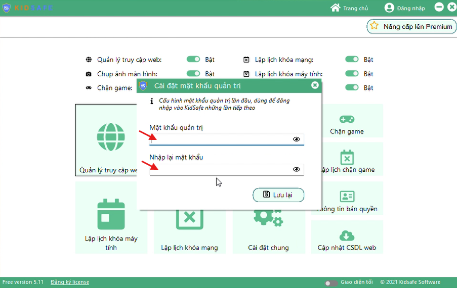

### Tải ứng dụng và cài đặt trên máy tính

#### Bước 1: Vào trang https://kidsafe.com.vn, nhấn nút “Download bộ cài”

#### Bước 2: Chờ file KidSafeSetup.exe được tải xong, mở file này để bắt đầu cài đặt

#### Bước 3: Quá trình cài

-   Chọn **"I accept the agreement"** và nhấn **"Next"**

    

-   Nhấn **"Next"**

    

-   Nhấn **"Next"**

    

-   Nhấn **"Next"**

    

-   Nhấn **"Install"**

    

-   Nhấn **"Finish"**

    

#### Bước 4: Sau khi cài xong, KidSafe hiển thị màn hình “Cài đặt mật khẩu quản trị”

Mật khẩu quản trị là mật khẩu tuỳ ý do bạn đặt.

Lưu ý: cần ghi nhớ mật khẩu quản trị này dùng để mở ứng dụng KidSafe ở các lần sau.

