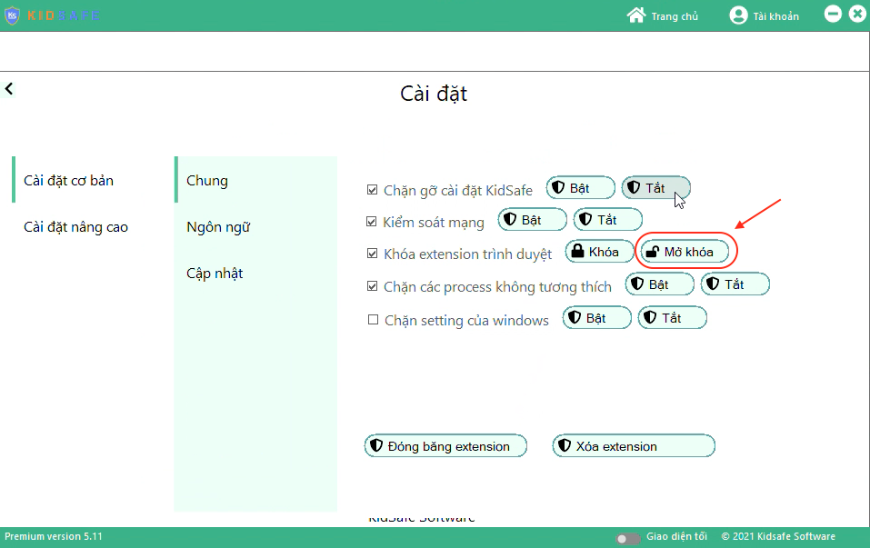
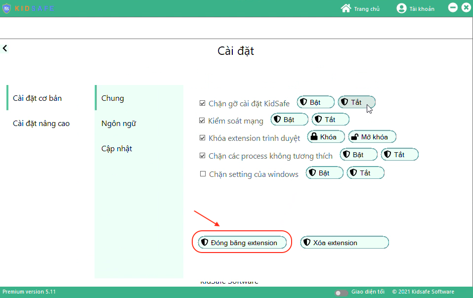
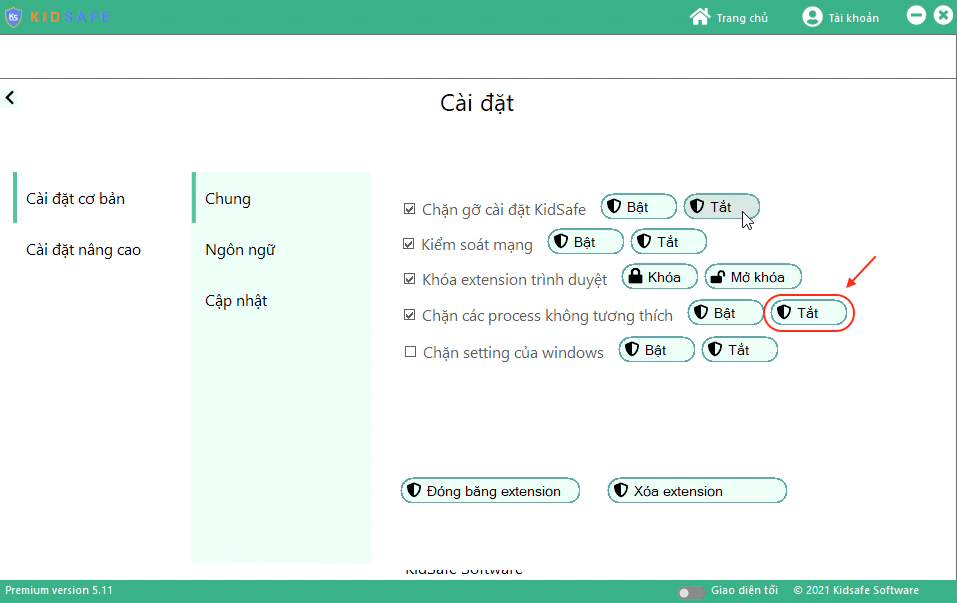

Tính năng này cho phép:

-   Tính năng chặn gỡ cài đặt
-   Tính năng khóa extension trình duyệt (ngăn chặn thủ thuật vào mạng trái phép)
-   Tính năng khóa vpn (ngăn chặn thủ thuật vào mạng trái phép)
-   Tính năng chặn process không tương thích
-   Tính năng hạn chế quảng cáo

## 2.8.1. Cài đặt extension trình duyệt

Bước 1: Mở khoá extension trình duyệt

-   Vào KidSafe trên máy tính > chức năng "Chức năng Cài đặt chung"
    
-   Dòng "Khoá extension trình duyệt" > Nhấn nút "Mở khoá"
    

Bước 2: Cài đặt extension trình duyệt

-   Trên các trình duyệt như edge, chrome, coccoc thực hiện cài đặt các extension mong muốn

Bước 3: Sau khi cài đặt extension xong, đóng băng extension trình duyệt

-   Ở chức năng "Cài đặt chung" > nhấn nút "Đóng băng extension"
    

## 2.8.2. Bỏ chặn cmd, task manager

-   Ở chức năng "Cài đặt chung" > Dòng "Chặn process không tương thích" > Nhấn nút "Tắt"
    
