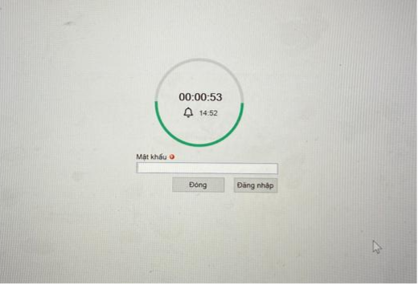

Tính năng này cho phép:

-   Cài đặt thời gian con được sử dụng máy tính. Tự động khóa máy tính ngoài thời gian được phép.
-   Thời gian sử dụng máy được cấu hình linh hoạt theo ngày trong tuần
-   Cấu hình các khoảng thời gian sử dụng máy chi tiết đến từng phút. Ví dụ cho dùng máy tính từ 7:45 đến 11:30
-   Có thể mở máy tính khẩn cấp từ xa khi con cần dùng máy trong khung giờ bị khóa

## Lập lịch khoá theo khung giờ

  

    

      
Tab “Điều khiển” > vùng “Điều khiển nhanh” > nhấn vào dòng “Lập lịch khoá máy tính”

      
  
        </img>
      

    

    

      
Ở màn hình lập lịch khoá máy tính tích chọn các khung giờ cần chặn

      
  
        </img>
      

    

  

## Màn hình khoá máy tính

-   Khi khoá máy tính màn hình sẽ hiển thị ra như dưới, có count down thời gian còn lại để mở khoá

